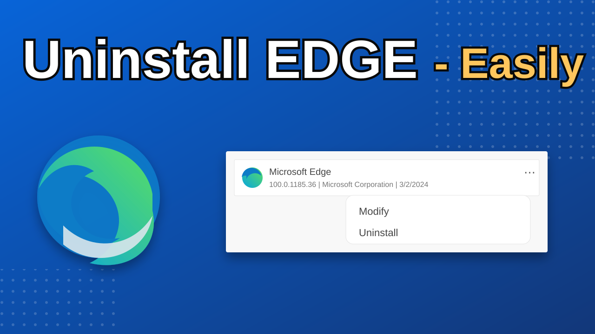

# Remove Microsoft Edge



Remove the Microsoft Edge application from Windows 10 and Windows 11 with a small administrator-run utility. The project includes executable, batch, and source-code options so you can choose the level of control you need.

> **Important:** Removing Edge is a system change. Create a restore point or backup first, close Edge and other Microsoft apps, and make sure Windows is fully updated before running the remover.

## Downloads

The [latest release](https://github.com/surjolive/Remove-MS-Edge/releases/latest) contains the signed build artifacts:

| File | Use |
| --- | --- |
| [Remove-Edge.exe](https://github.com/surjolive/Remove-MS-Edge/releases/latest/download/Remove-Edge.exe) | Remove the Edge application and keep WebView2 installed. |
| [Remove-EdgeWeb.exe](https://github.com/surjolive/Remove-MS-Edge/releases/latest/download/Remove-EdgeWeb.exe) | Remove Edge and the installed Edge WebView2 runtime. |
| [Remove-NoTerm.exe](https://github.com/surjolive/Remove-MS-Edge/releases/latest/download/Remove-NoTerm.exe) | Edge-only removal without a visible terminal window; useful with Task Scheduler. |

### Which file should I use?

Use `Remove-Edge.exe` for the normal, least disruptive removal. Use `Remove-EdgeWeb.exe` only when you also understand the compatibility impact of removing WebView2. Use `Remove-NoTerm.exe` when a hidden-window executable is required.

## Before You Run It

1. Install all pending Windows updates while Edge is still installed.
2. Close Edge, WebView2 applications, the Microsoft Store, and Windows Settings.
3. Create a restore point or another backup of important data.
4. Download the executable from the [release page](https://github.com/surjolive/Remove-MS-Edge/releases/latest).
5. Right-click the file, select **Properties**, and use **Unblock** if Windows shows that option.

The executable must be run as **Administrator**. If SmartScreen or antivirus software warns about the tool, review the source and release checksums before deciding whether to allow it. Do not use a build from an untrusted mirror.

## WebView2 Compatibility

Many applications use Microsoft Edge WebView2 even when Edge is not their browser. Removing WebView2 can affect applications such as Microsoft Photos, PowerToys, Xbox, Windows Mail, Quicken, Roblox, ImageGlass, and other tools that embed web content.

If you need those applications, use the Edge-only executable and leave WebView2 installed. The official [WebView2 download](https://developer.microsoft.com/en-us/microsoft-edge/webview2/) can be used to restore the runtime.

## Batch Scripts

The `Batch` folder provides scripts for users who prefer to inspect and run commands directly:

- [Both.bat](https://github.com/surjolive/Remove-MS-Edge/raw/main/Batch/Both.bat) removes Edge and WebView2.
- [Edge.bat](https://github.com/surjolive/Remove-MS-Edge/raw/main/Batch/Edge.bat) removes Edge while leaving WebView2 installed.
- [Edge-Appx.bat](https://github.com/surjolive/Remove-MS-Edge/raw/main/Batch/Edge-Appx.bat) removes the AppX Edge package while leaving WebView2 and Chrome-related components alone.

Review a batch file before running it and launch it from an elevated Command Prompt.

## Build From Source

Requires Python 3 and PyInstaller on Windows:

```powershell
python -m pip install --upgrade pyinstaller
pyinstaller --onefile --noconsole -i _Source/icon.ico -n Remove-Edge _Source/edge.py --add-data "_Source/setup.x64.exe;." --add-data "_Source/setup.x86.exe;."
```

The source build expects `setup.x64.exe`, `setup.x86.exe`, and `icon.ico` in `_Source`. Build the console variant by removing `--noconsole`; use the project release artifacts when you need the maintained packaged builds.

## Restore Edge or Fix Updates

If an application requires Edge, reinstall it from the official [Microsoft Edge download page](https://www.microsoft.com/edge/download). If Windows Update enters a failure loop, reinstall Edge, complete pending updates, and remove Edge again afterward. The upstream project also provides a [Windows Update repair script](https://raw.githubusercontent.com/ShadowWhisperer/Fix-WinUpdates/main/Fix%20Updates.bat).

To restore Internet Explorer compatibility integration in Edge settings, run this elevated command:

```cmd
reg add "HKLM\SOFTWARE\Microsoft\Internet Explorer\EdgeIntegration" /v "Supported" /t REG_DWORD /d 1 /f
```

## Troubleshooting

- **Access denied:** relaunch the executable or batch file as Administrator.
- **Edge comes back after an update:** Windows may reinstall or repair bundled components; finish updates first, then run the remover again.
- **An application stopped working:** reinstall WebView2 from the official Microsoft link above, or restore Edge if the application requires the browser itself.
- **The download is blocked:** verify that the file came from this repository's release page and compare its checksum before permitting it.

## Contributing

Open an issue with your Windows version, architecture, edition, remover filename, and the exact error message. For pull requests, explain the Windows versions tested and whether Edge or WebView2 was removed. Please keep changes focused and test on a disposable or backed-up machine.

## License

This project is available under the [MIT License](LICENSE).
